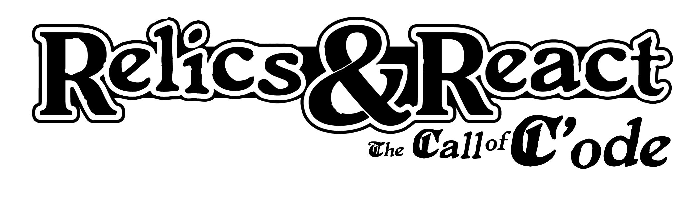

Delivery Day 1:

1. Members in group:
        Corey
        Mara
        Mitch
        Bean

2. What the app will do?
        A single-player browser-based adventure that is evocative of a pen-and-paper RPGs.

3. What technologies do we expect our app to implement?
        -React
        -React transitions/router transitions
        -Express
        -MySQL/sequelize
        -Possibility of Mongoose/MongoDB
        -Needed npm's as we develop

4. Who will be responsible for each part of the app?
        -Mara:
            React/Ui/UX Flow/Design
        -Bean:
            React/UX
        -Mitch:
            Backend/Game Flow
        -Corey
            Backend/Game Flow

5. Who will be responsible for each part of deliverable 1?
        -Mara:
            A set of DETAILED screen-by-screen design layouts with annotations describing all UI/UX components relevant to the screen.
        -Mitch:
            An overview of the intended applications and WHY you feel its valuable.
        -Bean:
            A breakdown of roles by group member.
        -Corey:
            A schedule for completion of various tasks.
            A screenshot of Trello that shows breakdown of said various tasks and schedules.